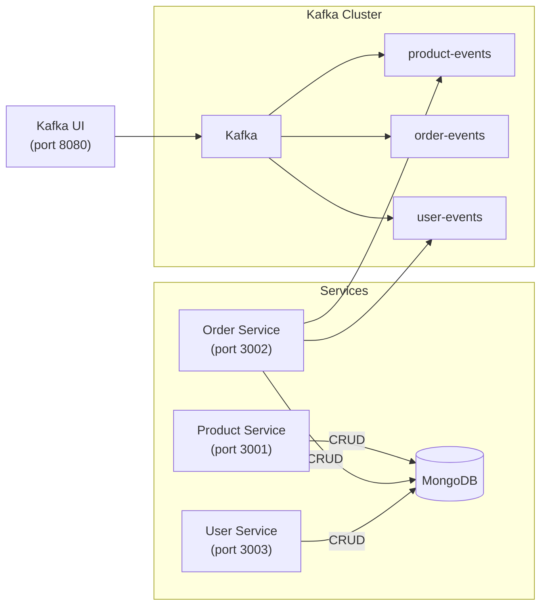
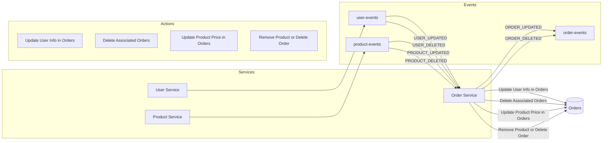

[](https://nodejs.org/)
[](https://expressjs.com/)
[](https://www.docker.com/)
[](https://www.mongodb.com/)
[](https://kafka.apache.org/)
[](https://k6.io/)

# USP MBA Final Paper

## **Table of Contents**
- [Overview](#overview)
- [Project Structure](#project-structure)
- [Setup](#setup)
    - [Prerequisites](#prerequisites)
    - [Build and run the services](#build-and-run-the-services)
- [API Endpoints](#api-endpoints)
- [Kafka Topics (Event-Driven Architecture)](#kafka-topics-event-driven-architecture)
    - [Kafka UI](#kafka-ui)
- [Performance Testing](#performance-testing)
    - [Running the Load Test](#running-the-load-test)

## Overview
This project aims to compare the performance of microservices and event-driven architectures in the context of a simple e-commerce application. It uses Node.js, Express, MongoDB, Kafka, and Docker to simulate an e-commerce system with product, order, and user services.

## Project Structure
- `./microservices-project`: Contains the implementation using a microservices architecture.
- `./event-driven-project`: Contains the implementation using an event-driven architecture with Kafka.

## Setup
### Prerequisites
- Docker
- Docker Compose

### Build and run the services
1. Microservices
```bash
cd microservices-project
docker-compose up --build
```

2. Event-driven:
```bash
cd event-driven-project
docker-compose up --build
```

## API Endpoints
1. Product Service (http://localhost:3001)
    - `GET /products`: List all products
    - `GET /products/:id`: Get product details by ID
    - `POST /products`: Create a new product
    - `PUT /products/:id`: Update a product
    - `DELETE /products/:id`: Delete a product

2. Order Service (http://localhost:3002)
    - `GET /orders`: List all orders
    - `GET /orders/:id`: Get order details by ID
    - `POST /orders`: Create a new order
    - `PUT /orders/:id`: Update an order (e.g., change status)
    - `DELETE /orders/:id`: Delete an order

3. User Service (http://localhost:3003)
    - `GET /users`: List all users
    - `GET /users/:id`: Get user details by ID
    - `POST /users`: Create a new user
    - `PUT /users/:id`: Update a user
    - `DELETE /users/:id`: Delete a user



## Kafka Topics (Event-Driven Architecture)
- `product-events`: Events related to product creation, update, and deletion.
- `order-events`: Events related to order creation, update, and deletion.
- `user-events`: Events related to user creation, update, and deletion.



### Kafka UI
The `docker-compose.yml` file includes a Kafka UI to visualize and manage Kafka topics and events. Access it at http://localhost:8080.

## Performance Testing
This project uses k6 to perform load testing and evaluate the performance of the microservices and event-driven architectures.

### Running the Load Test
1. Install k6: If you haven't already, install k6 globally using npm:
```bash
npm install -g k6
```

2. Start the services you want to evaluate: microservices or event-driven architectures

3. Navigate to the test directory and execute the load test: Run the k6 script:
```bash
cd test
k6 run ecommerce-load-test.js
```
This will execute the load test scenarios defined in the script and display the results in your terminal.